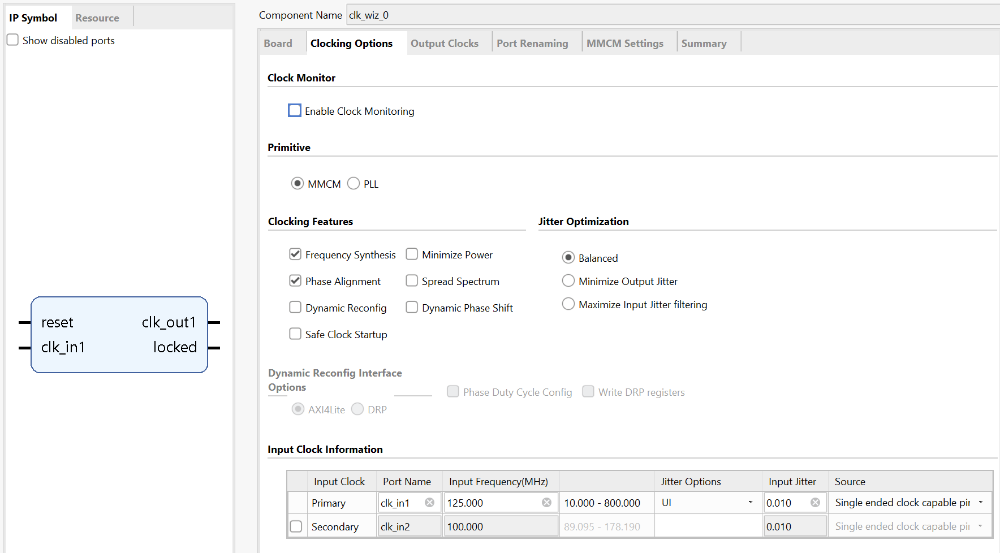
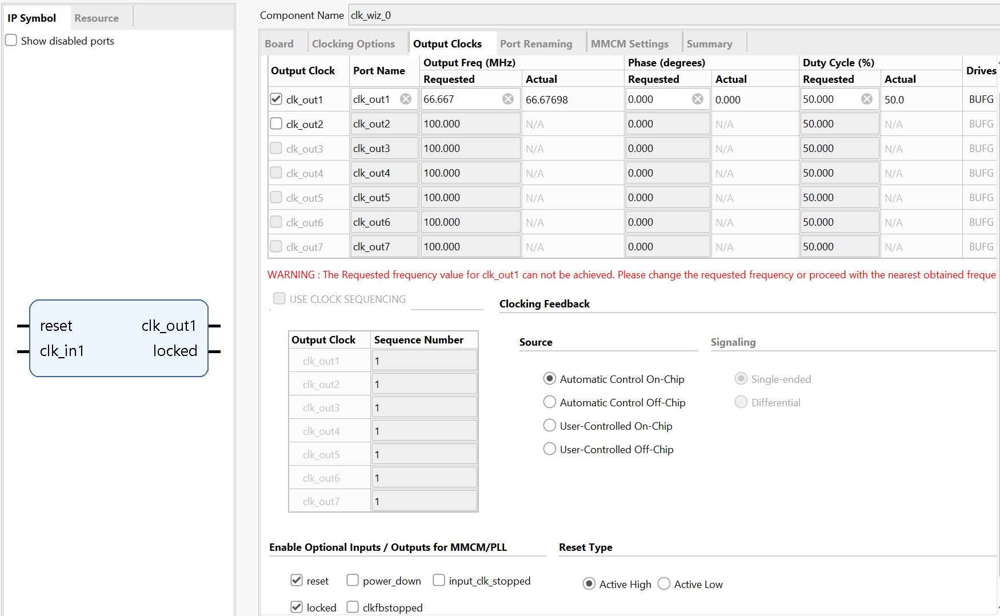
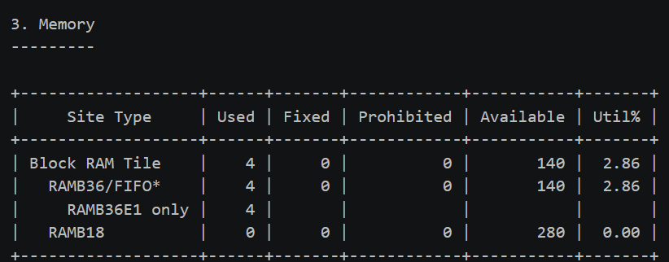
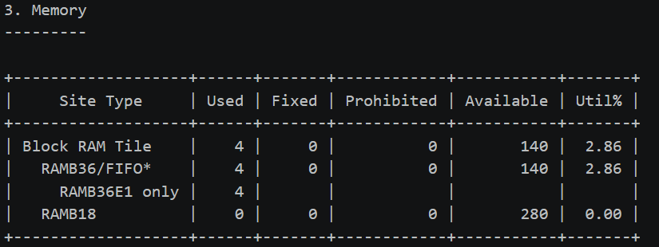

디지털회로설계및언어

프로젝트 2 보고서

: Simple CPU 기반 int8 GEMM

가속기 코프로세서 설계 최적화 및 검증

[2조]


| 학번 | 이름 |
| --- | --- |
| 2021104248 | 박성모 |
| 2022104291 | 유경민 |
| 2023104135 | 한영웅 |

제출자:

I. 프로젝트 개요 및 전체 구조

II. 인터페이스: ISA 및 MMIO 레지스터

1. CPU ISA와 GEMM 호출 프로그램

2. MMIO 레지스터 맵과 transaction 프로토콜

3. 메모리 레이아웃 (A/B/C packing)

III. 설계 최적화 과정

1. 1-MAC baseline — 두 가지 병목 확인

2. 4-MAC (N 방향 병렬화)

3. Adder-Tree (K 방향 병렬화)

4. Dual-port 메모리 구조 — compute 개선 이후 부각된 load 최적화

5. 최적 아키텍처 선택

6. 평가 구성 및 커버리지

IV. Module 구성

1. 최상위 모듈 (gemm_system_top.v)

2. CPU–GEMM Glue (gemm_cpu_glue.v)

3. MMIO 레지스터 및 차원 검증 (gemm_mmio_reg.v)

4. Controller FSM / Local Buffer / LSU

5. MAC Datapath 3종 (1-MAC / 4-MAC / Adder-Tree)

6. IP 구성

7. XDC 제약 (Zybo-Z7.xdc)

V. 결과 및 분석

1. 기능 검증 (Verilator)

2. ASIC 합성/P&R 결과 (Oasys / Nitro, 250nm)

3. FPGA 검증 (Zybo Z7-20, 주파수 sweep + 실물 동작)

4. ASIC-FPGA 전력 비교

VI. 결론

부록

A. 전체 소스 코드


# I. 프로젝트 개요 및 전체 구조
본 프로젝트는 Project 1에서 설계한 accumulator 기반 Simple CPU를, MMIO로 제어되는 int8 GEMM(General Matrix Multiply) 코프로세서로 확장한 것이다. 기존의 CPU는 수정 하지 않고 , 행렬곱 연산 C = A × B 를 전담하는 가속기를 별도 모듈로 붙여 CPU가 MMIO register write/read 만으로 작업을 지시하고 상태를 확인하도록 설계하였다.

핵심 설계 목표는 다음과 같다. (1) CPU를 수정하지 않고 코프로세서를 통합한다. (2) 동일한 구조 위에서 연산 datapath만 1-MAC / 4-MAC / 0-MAC (Adder-Tree) 세 가지로 파라미터화하여 PPA(Performance·Power·Area)를 비교한다. (3) Verilator 기능 검증, ASIC 합성/P&R(Oasys/Nitro, 250nm), FPGA 실물 검증(Zybo Z7-20)의 세 축으로 설계를 검증한다.


## 전체 데이터 흐름

```verilog
        [ Simple CPU (top_cpu) ]   ← 원본
                 │ 단일 메모리 포트
                 ▼
        [ gemm_cpu_glue ]   CPU↔GEMM 라우팅 + busy 중재
          │                         │
   MMIO write/read              busy 동안 CPU freeze
          ▼                         ▼
  [ gemm_accelerator_top (MAC_MODE 파라미터) ]
     ├ gemm_mmio_reg        MMIO 레지스터 + 차원 검증
     ├ gemm_controller_fsm  IDLE→LOAD→COMPUTE→STORE→DONE
     ├ gemm_local_buffer    a/b_buf(int8), c_buf(int32)
     ├ gemm_lsu             Load/Store Unit (듀얼포트)
     └ [MAC_MODE별 datapath] 1-MAC / 4-MAC / Adder-Tree
                 │ 듀얼포트
                 ▼
        [ External Data Memory (BRAM, 4K word) ]
```


## 핵심 설계 결정
CPU 무수정 통합 — glue가 CPU의 단일 메모리 포트를 가로채 MMIO 영역과 BRAM으로 라우팅한다. CPU는 자신이 BRAM을 읽는지 GEMM status를 읽는지 알지 못한다.

Stall-free 중재 — GEMM busy 동안 CPU를 freeze(clk_enable=0)시키고 LSU가 메모리를 독점한다. busy가 풀리면 CPU가 재개되며, 별도의 stall 로직이 없다.

듀얼포트 메모리 — Port A(A 읽기 + C 쓰기) / Port B(B 읽기)로 A·B를 병렬 로드한다.

연산 mode 파라미터화 — MAC_MODE로 datapath만 교체하고 나머지 구조(FSM, buffer, LSU, MMIO)는 공유하여 공정한 PPA 비교가 가능하다.


## 설계 사양 (Design Specification)

| 항목 | 내용 |
| --- | --- |
| 기준 연산 | C = A × B |
| 행렬 크기 | 1 ≤ M, N, K ≤ 4 |
| 입력 타입 | signed int8 |
| 곱 타입 / 누산·출력 타입 | signed int16 / signed int32 |
| A/B 메모리 포맷 | 32-bit word에 signed int8 4개 packing |
| C 메모리 포맷 | 32-bit word당 signed int32 1개 |
| 주소 방식 | word address (12-bit, 4K word) |
| CPU 제어 | MMIO register write/read |

추가적으로, 지원하지 않는 차원(M·N·K가 1~4 범위를 벗어남)이 들어오면 GEMM data phase를 시작하지 않고 done=1, error=1, invalid_size=1 상태로 종료하도록 설계하였다.


# II. 인터페이스: ISA 및 MMIO 레지스터

## 1. CPU ISA와 GEMM 호출 프로그램

```verilog
CPU는 이전 Project 1의 accumulator 기반 ISA를 그대로 사용한다. GEMM 호출은 별도의 명령어 추가 없이, 기존 LOAD/STORE 명령으로 MMIO 주소(0xFF0~0xFF7)에 값을 읽고 쓰는 것만으로 이루어진다. 즉 GEMM 가속기는 CPU 입장에서 특별한 메모리 영역일 뿐이다.
```
실제 보드/검증에서 사용하는 호출 프로그램(gemm_call.asm)은 2×2×2 행렬곱을 수행한다. 동작 순서는 다음과 같다.


```verilog

; A_BASE=0x20 B_BASE=0x50 C_BASE=0x80, M=N=K=2
ORG 0
        LOADI 0x20
        STORE 0xFF0   ; A_BASE 설정
        LOADI 0x50
        STORE 0xFF1   ; B_BASE 설정
        LOADI 0x80
        STORE 0xFF2   ; C_BASE 설정
        LOADI 0x2  
        STORE 0xFF3   ; M = 2
        LOADI 0x2
        STORE 0xFF4   ; N = 2
        LOADI 0x2
        STORE 0xFF5   ; K = 2
        LOADI 0x1
        STORE 0xFF6   ; CTRL.start (transaction 시작)
POLL:
        LOAD 0xFF7    ; status polling
        CMPI 0x2
        JZ FINISH
        JMP POLL
FINISH:
        LOADI 0x2
        STORE 0xFF6  ; clear_done
        LOADI 0x8
        OUT 0x0      ; out_port ← 0x8 (정상종료 LED 표시)
HALT:
        JMP HALT
```

CPU는 status(0xFF7)를 폴링하다가 그 값이 정확히 2(busy=0, done=1, error=0, invalid_size=0)가 될 때만 POLL 루프를 빠져나와 led[3]을 켠다.

즉 "정상 완료 = LED on, 비정상 = 무한 대기(LED off)" 구조이다.


## 2. MMIO 레지스터 맵과 transaction 프로토콜
CPU와 GEMM은 0xFF0~0xFF7의 MMIO register block으로 통신한다. CPU는 write로 작업 조건을 넘기고 read로 진행 상태를 확인한다.


| 주소 | 레지스터 | 접근 | 의미 |
| --- | --- | --- | --- |
| 0xFF0 | GEMM_A_BASE | W | A matrix 시작 word address |
| 0xFF1 | GEMM_B_BASE | W | B matrix 시작 word address |
| 0xFF2 | GEMM_C_BASE | W | C matrix 저장 word address |
| 0xFF3 | GEMM_M | W | C의 row 수 (= A의 row) |
| 0xFF4 | GEMM_N | W | C의 column 수 (= B의 column) |
| 0xFF5 | GEMM_K | W | A의 column (= B의 row) |
| 0xFF6 | GEMM_CTRL | W | start / clear_done (pulse) |
| 0xFF7 | GEMM_STATUS | R | busy / done / error / invalid_size |

STATUS 비트 정의


| Bit | Field | 의미 |
| --- | --- | --- |
| [0] | busy | GEMM accelerator 연산 중 (LOAD/COMPUTE/STORE) |
| [1] | done | transaction 종료  (성공 여부는 error와 함께 판단) |
| [2] | error | 정상 수행 불가 |
| [3] | invalid_size | M·N·K가 지원 범위(1~4)를 벗어남 |


```verilog
[transaction 흐름]
: CPU가 base/dimension을 write → CTRL.start write → busy 동안 CPU freeze → accelerator가 dimension 검증 후 LOAD→COMPUTE→STORE 수행 → done=1, busy=0 → CPU 재개
(done/error는 sticky 상태로, CPU가 clear_done을 write하기 전까지 유지된다)
```

## 3. 메모리 레이아웃 (A/B/C packing)
external data memory는 32-bit word, 12-bit word address(4K word) 구조이다. 주소는 byte가 아니라 word 단위이다.


```verilog
 // gemm_lsu.v   
    wire [7:0] a_lane = a_word[ {a_col[1:0], 3'b000} +: 8 ];
    wire [7:0] b_lane = b_word[ {b_col[1:0], 3'b000} +: 8 ];
 // golden_gemm.py
def write_packed_int8_matrix(
    memory: dict[int, int],
    base: int,
    matrix: list[list[int]],
) -> None:
    _rows, cols = matrix_shape(matrix)
    row_words = packed_word_count(cols)
    for row, matrix_row in enumerate(matrix):
        for word_index in range(row_words):
            start = word_index * 4
            memory[base + row * row_words + word_index] = pack_int8x4(
                matrix_row[start : start + 4]
            )
```

A/B 입력은 row-major로 한 word에 signed int8 최대 4개를 packing하고(lane0 = word[7:0], lane1 = word[15:8], lane2 = [23:16], lane3 = word[31:24]), row가 끝나면 zero padding한다.


```verilog
    SS_WR: begin
          mem_addr_a <= c_base + {7'd0, selem};
          mem_wdata  <= c_rdata;
          mem_we     <= 1'b1;
```

C 출력은 packing 없이 word당 int32 1개로 저장한다.

다음은 memory 내부의 구성이다.


| 주소 범위 | 영역 | 용도 |
| --- | --- | --- |
| 0x000 – 0x07F | Instruction | CPU 명령어 |
| 0x080 – 0xFEF | Data | A/B 입력 및 C 출력 행렬 |
| 0xFF0 – 0xFF7 | GEMM MMIO | GEMM 제어/상태 레지스터 |
| 0xFF8 – 0xFFF | Reserved | 향후 MMIO 확장 (현재 미사용) |


# III. 설계 최적화 과정
Baseline 구현에서 병목을 확인하고 단계적으로 구조를 발전시킨 결과이다.


## 1. 1-MAC baseline — 두 가지 병목 확인
초기 구현은 1-MAC 직렬 방식이다. 출력 원소 C[i][j]마다 누산기를 초기화하고 k 방향으로 한 사이클에 곱셈 1개씩 순차 수행한다. 이 구현에서 두 가지 병목을 확인하였다.

첫째, Fmax 병목이다. ASIC 합성(step3) 결과 critical path가 MAC datapath 내부가 아니라 CPU의 inst_reg → accumulator 경로(CPU ALU)에 있었다. MAC 구조를 어떻게 바꾸더라도 최대 동작 주파수 자체는 개선되지 않는다. 이는 FPGA 주파수 sweep에서 1-MAC과 4-MAC 모두 66.7 MHz로 수렴한 결과와도 일치한다.

둘째, throughput 병목이다. 전체 연산 사이클이 M·N·K에 비례하여 직렬로 증가하는 구조적 한계가 있다. Fmax 병목과 달리 이쪽은 datapath 병렬화로 직접 개선이 가능하다.


## 2. 4-MAC (N 방향 병렬화)
두 병목 중 구조적으로 개선할 수 있는 것은 throughput이므로, N 방향 병렬화를 적용하여 4-MAC으로 발전시켰다. 고정된 row i에 대해 4개의 누산기(acc0~3)가 동일한 A[i][k]를 공유하며 k 루프를 함께 진행하므로, 연산 사이클이 M·K 수준으로 단축된다. Fmax는 여전히 CPU ALU 경로에 의해 제한되지만, 동일 클럭 하에서 처리에 필요한 사이클 수가 줄어드는 실질적인 개선이다. 다만 4개의 MAC이 한 사이클에 동시에 토글하므로 동적 전력이 증가하였으며, ASIC VCD 기반 측정에서 switching power가 1-MAC 대비 약 51% 증가(15.1 → 22.8 mW)한 것이 이를 보여준다.


## 3. Adder-Tree (K 방향 병렬화)
4-MAC은 N 방향 병렬화이므로 N < 4인 케이스에서 유휴 MAC이 발생하는 구조적 비효율이 있다. 예를 들어 N=2이면 acc2, acc3은 연산은 수행하지만 결과를 버리게 된다. 이를 개선하기 위해 N 크기에 무관하게 내적 연산 자체를 병렬화하는 Adder-Tree 방식을 시도하였다. K 방향의 내적을 한 사이클에 4개씩 묶어 adder tree로 합산함으로써, N이 작은 케이스에서도 4-MAC보다 효율적일 것이라는 기대였다. 그러나 본 설계의 지원 범위(K ≤ 4)에서는 한 사이클에 처리 가능한 K 원소가 어차피 최대 4개로 제한되어 실질적인 사이클 단축 효과가 나타나지 않았고, 오히려 곱셈기 4개와 가산기 트리가 동시에 필요해 면적은 세 방식 중 가장 크다. K ≤ 4라는 설계 범위 제약이 AT의 이점을 상쇄한 결과이다.


## 4. Dual-port 메모리 구조 — compute 개선 이후 부각된 load 최적화

```verilog
4-MAC으로 compute 사이클을 단축하고 나니, 상대적으로 LOAD 단계의 사이클 비중이 부각되었다. 단일 포트 구조에서는 A와 B를 순차적으로 읽어야 하므로 load 사이클이 compute 개선 효과를 일부 상쇄하는 구조였다. Port A(A 읽기 + C 쓰기)와 Port B(B 읽기)를 분리한 dual-port 구조로 전환하여 A·B를 병렬 로드함으로써 load 사이클을 절반으로 줄였다(4×4×4 기준 51→27, 52.9%). 이 구조가 rtl_v2의 핵심 변경점이며, Vivado에서 RAMB36E1 4개로 정상 매핑됨을 FPGA 검증에서 확인하였다. 다만 이는 가장 큰 4×4×4 케이스 기준이고, 작은 차원이 섞인 mixed_case 집계 평균으로는 load 감소폭이 더 작다(`docs/reports/project2_gemm_verification_report.md`의 mixed_case 표 기준 2161→1394, 약 35% 감소).
```

## 5. 최적 아키텍처 선택
위 단계를 거쳐 4-MAC datapath와 dual-port 메모리를 결합한 rtl_v2 구성을 대표 target으로 선정하였다. AT는 K ≤ 4 범위에서 이득이 없고 면적이 크므로 채택하지 않았다. Fmax 병목은 여전히 CPU ALU 경로에 있으므로, 향후 성능 향상의 우선순위는 MAC 병렬화 확장보다 CPU ALU 경로 최적화 또는 파이프라인 도입에 두는 것이 타당하다.


## 6. 평가 구성 및 커버리지 정의
위 설계 진화 과정에서 다음 두 축의 선택지가 확정되었다.

첫째, MAC_MODE 파라미터 — datapath 종류를 결정하는 정수값으로, MAC_MODE=1(1-MAC 직렬), MAC_MODE=4(4-MAC 병렬), MAC_MODE=0(Adder-Tree)으로 구분한다. 이후 결과 및 분석에서 mode1 / mode4 / mode0(AT)로 약칭한다.

둘째, 메모리 포트 구성 — single-port(rtl, rtl_AT: A·B 순차 로드)와 dual-port(rtl_v2: A·B 병렬 로드)로 구분한다. dual-port가 ④에서 도입한 구조이며 rtl_v2의 핵심 변경점이다.

이 두 축의 조합으로 평가 대상은 다음 4가지로 구성된다.


| 구성 | MAC_MODE | 메모리 | RTL 버전 |
| --- | --- | --- | --- |
| single + 1-MAC | mode1 | single-port | rtl |
| single + AT | mode0 | single-port | rtl_AT |
| dual + 1-MAC | mode1 | dual-port | rtl_v2 |
| dual + 4-MAC | mode4 | dual-port | rtl_v2 |


# IV. Module 구성
본 시스템의 최상위는 gemm_system_top이며, (1) 원본 그대로의 Simple CPU(top_cpu), (2) CPU와 가속기를 잇는 glue(gemm_cpu_glue), (3) GEMM 코프로세서(gemm_accelerator_top), (4) 듀얼포트 외부 메모리(BRAM)로 구성된다. 가속기 내부는 다시 MMIO 레지스터, controller FSM, local buffer, LSU, 그리고 MAC_MODE로 교체되는 datapath로 나뉜다. 전체 계층은 다음과 같다.


```verilog
        [ Simple CPU (top_cpu) ]   ← 원본
                 │ 단일 메모리 포트
                 ▼

        [ gemm_cpu_glue ]   CPU↔GEMM 라우팅 + busy 중재

          │                         │
   MMIO write/read              busy 동안 CPU freeze
          ▼                         ▼

  [ gemm_accelerator_top (MAC_MODE 파라미터) ]
     ├ gemm_mmio_reg        MMIO 레지스터 + 차원 검증
     ├ gemm_controller_fsm  IDLE→LOAD→COMPUTE→STORE→DONE
     ├ gemm_local_buffer    a/b_buf(int8), c_buf(int32)
     ├ gemm_lsu             Load/Store Unit (듀얼포트)
     └ [MAC_MODE별 datapath] 1-MAC / 4-MAC / Adder-Tree

                 │ 듀얼포트
                 ▼

        [ External Data Memory (BRAM, 4K word) ]
```


## 1. 최상위 모듈 (gemm_system_top.v)

```verilog
gemm_system_top은 CPU·glue·가속기·메모리를 묶고, MAC_MODE 파라미터를 가속기로 전달하는 최상위 wrapper이다. 외부로는 clk, reset, in_port[8:0], out_port[3:0]과 디버그 신호만 노출한다.
이 모듈에서 가장 중요한 설계 포인트는 CPU를 멈추고 재개하는 clk_enable 게이팅 이다. GEMM이 busy인 동안에는 CPU를 정지시켜 LSU가 메모리를 독점하는데, busy→clk_enable→cpu_we→mmio→busy로 이어지는 조합 경로가 합성 도구에서 combinational loop로 잡힌다. 이를 끊기 위해 cpu_run을 한 클럭 레지스터에 통과시킨다.
```

```verilog
    reg cpu_run_r;
    always @(posedge clk) begin
        if (reset) cpu_run_r <= 1'b1;
        else       cpu_run_r <= cpu_run;
    end

    top_cpu u_cpu (
        .clk(clk), .reset(reset),
        .clk_enable(cpu_run_r),
        .bram_rdata(cpu_rdata),
        .bram_addr(cpu_addr),
        .bram_wdata(cpu_wdata),
        .bram_we(cpu_we),
        .in_port(in_port),
        .out_port(out_port),
        .pc_debug(pc_debug),
        .acc_debug(acc_debug),
        .zero_flag_debug(cpu_zero_flag_debug),
        .state_debug(cpu_state_debug)
    );
```

```
freeze/resume에 1클럭 지연이 생기지만, CPU는 긴 GEMM busy 구간에서만 정지하므로 영향이 없다. 또한 외부 메모리는 동기식 read를 갖는 듀얼포트 BRAM으로 모델링하며, Port A는 A 읽기와 C 쓰기, Port B는 B 읽기를 담당한다.


```verilog
    reg [31:0] mem [0:4095];
    reg [31:0] bram_rdata_a_r, bram_rdata_b_r;
    always @(posedge clk) begin
        if (bram_we_a) mem[bram_addr_a] <= bram_wdata_a;  // port A write
        bram_rdata_a_r <= mem[bram_addr_a];                    // prot A read
        bram_rdata_b_r <= mem[bram_addr_b];                    // prot B read
    end
    assign bram_rdata_a = bram_rdata_a_r;
    assign bram_rdata_b = bram_rdata_b_r;

`ifdef GEMM_MEM_INIT
    initial $readmemh(`GEMM_MEM_INIT, mem);
`endif
```

이 메모리 코딩 스타일(동기식 read, write/read 포트 분리)은 Vivado가 표준 dual-port BRAM 추론 템플릿으로 인식하여 보드에서는 RAMB36E1로 매핑된다(IV장 참고). GEMM_MEM_INIT define으로 $readmemh 가 활성화되며, 보드에서는 프로그램과 A/B 데이터를 합친 hex 이미지를 여기로 프리로드한다.


## 2. CPU–GEMM Glue (gemm_cpu_glue.v)
glue는 단일 메모리 포트만 가진 원본 CPU와, 가속기가 공유하는 듀얼포트 BRAM 사이의 통합 계층이다. 세 가지 역할을 한다 — (1) 주소 디코드, (2) CPU-freeze 중재, (3) MMIO/BRAM 라우팅.


### 1) 주소 디코드와 CPU-freeze 중재
CPU가 접근하는 주소가 MMIO 블록(0xFF0~0xFF7)인지 판별하고, GEMM이 busy이면 CPU를 정지시킨다(stall-free arbitration).


```verilog
    wire cpu_is_mmio = (cpu_addr >= `GEMM_MMIO_BASE) &&
                       (cpu_addr <= `GEMM_MMIO_LAST);

    assign cpu_run = ~gemm_busy;  // busy: CPU 정지, idle: 실행
```


### 2) BRAM 포트 소유권 전환
핵심은 동일한 BRAM 포트를, busy 여부에 따라 CPU와 LSU가 번갈아 소유한다는 점이다. busy일 때는 LSU가 Port A/B를 모두 독점하고, idle일 때는 CPU가 Port A를 쓴다. CPU가 MMIO 영역을 접근할 때는 BRAM에 write가 일어나면 안 되므로 we 조건에서 제외한다.


```verilog
   // Port A: busy면 LSU(A읽기/C쓰기), idle이면 CPU
 assign 
bram_addr_a  = gemm_busy ? lsu_addr_a : cpu_addr;
    assign bram_wdata_a = gemm_busy ? lsu_wdata  : cpu_wdata;
    assign bram_we_a    = gemm_busy ? lsu_we
                                    : (cpu_we & ~cpu_is_mmio);

// Port B: busy면 LSU(B읽기), idle이면 미사용(CPU는 포트1개)
    assign bram_addr_b = gemm_busy ? lsu_addr_b : 12'd0;
```


### 3) Read 데이터 정렬 (MMIO vs BRAM)
CPU가 status(0xFF7)를 읽을 때는 BRAM이 아니라 MMIO에서 값을 받아야 한다. BRAM은 동기식 read라 1클럭 지연이 있으므로, MMIO read도 같은 지연을 맞춰 정렬한 뒤 선택한다.


```verilog
    reg        mmio_sel_d;
    reg [31:0] mmio_rdata_d;
    always @(posedge clk) begin
        mmio_sel_d   <= cpu_is_mmio;
        mmio_rdata_d <= mmio_rdata;
    end

    assign cpu_rdata = mmio_sel_d ? mmio_rdata_d : bram_rdata_a;

```

이 glue 덕분에 CPU는 자신이 BRAM을 읽는지 GEMM status를 읽는지 전혀 알 필요가 없으며, CPU의 ISA와 datapath 동작은 유지한 채, 상위 glue logic을 통해 메모리/MMIO 접근을 중재하였다.


## 3. MMIO 레지스터 및 차원 검증 (gemm_mmio_reg.v)
gemm_mmio_reg는 CPU가 write한 작업 조건(A/B/C base, M/N/K)을 저장하고, CTRL.start를 controller FSM으로 전달하며, status를 32-bit word로 합쳐 CPU에 반환한다.


```verilog
always @(posedge clk) begin        if (reset) begin
            r_a_base <= 12'd0; r_b_base <= 12'd0; r_c_base <= 12'd0;
            r_m <= 3'd0; r_n <= 3'd0; r_k <= 3'd0;

            r_m_oor <= 1'b0; r_n_oor <= 1'b0; r_k_oor <= 1'b0;
        end
        else if (mmio_sel & mmio_we) begin
            case (mmio_off)
                `GEMM_OFF_A_BASE: r_a_base <= mmio_wdata[11:0];
                `GEMM_OFF_B_BASE: r_b_base <= mmio_wdata[11:0];
                `GEMM_OFF_C_BASE: r_c_base <= mmio_wdata[11:0];
                `GEMM_OFF_M: begin r_m <= mmio_wdata[2:0]; r_m_oor <= ~wdata_in_range; end
                `GEMM_OFF_N: begin r_n <= mmio_wdata[2:0]; r_n_oor <= ~wdata_in_range; end
                `GEMM_OFF_K: begin r_k <= mmio_wdata[2:0]; r_k_oor <= ~wdata_in_range; end
                default: ; // CTRL handled via pulses; STATUS is read-only
            endcase
        end
    end
```

레지스터 맵은 다음과 같다.


| 주소 | 레지스터 | 접근 | 용도 |
| --- | --- | --- | --- |
| 0xFF0 ~ 0xFF2 | A,B,C_BASE | W | 각 행렬의 시작 (word address) |
| 0xFF3 ~ 0xFF5 | M,N,K | W | 행렬 차원 (각 1~4) |
| 0xFF6 | CTRL | W | [0] start. [1] clear_done (pulse) |
| 0xFF7 | STATUS | R | [0]busy [1]done [2]error [3]invalid_size |

CTRL write는 저장되는 상태가 아니라 one-cycle pulse 명령 으로 해석된다. start는 IDLE에서만 의미가 있고, busy 동안에는 CPU가 freeze되어 새 start를 발행하지 못한다.


```verilog
    always @(posedge clk) begin
        if (reset) begin
            s_done <= 1'b0; s_error <= 1'b0; s_invsize <= 1'b0;
        end
        else if (clear_pulse) begin
            s_done <= 1'b0; s_error <= 1'b0; s_invsize <= 1'b0;
        end
        else begin
            if (fsm_set_done)    s_done    <= 1'b1;
            if (fsm_set_error)   s_error   <= 1'b1;
            if (fsm_set_invsize) s_invsize <= 1'b1;
        end
    end
```

가장 중요한 기능은 차원 검증 으로, M·N·K가 지원 범위(1~4)를 벗어나면 data phase를 시작하지 않고 done과 error 계열 플래그는 sticky 상태로, CPU가 CTRL.clear_done(비트 1)을 write하기 전까지 유지된다. 따라서 CPU는 연산이 끝난 뒤 결과를 안전하게 읽고, clear_done을 통해 sticky status flag를 지우고, 다음 transaction을 시작할 수 있는 상태로 정리한다.


## 4. Controller FSM / Local Buffer / LSU

### 1) Controller FSM (gemm_controller_fsm.v)

```verilog
가속기의 전체 transaction을 5개 상태의 순환으로 제어한다. start pulse를 받으면 차원 검증 결과(dims_ok)에 따라 LOAD로 진입하거나 곧바로 DONE으로 빠진다(invalid 처리). 이후 LOAD→COMPUTE→STORE를 거쳐 DONE에서 done을 세우고, clear_done이 오면 IDLE로 복귀한다.
```

```verilog
    always @(posedge clk) begin
        if (reset) state <= `GEMM_S_IDLE;
        else       state <= next_state;
    end

    always @(*) begin
        next_state = state;
        case (state)
            `GEMM_S_IDLE: begin
                if (start_pulse)
                    next_state = dims_ok ? `GEMM_S_LOAD : `GEMM_S_DONE;
            end
            `GEMM_S_LOAD:    if (lsu_load_done)  next_state = `GEMM_S_COMPUTE;
            `GEMM_S_COMPUTE: if (mac_done)       next_state = `GEMM_S_STORE;
            `GEMM_S_STORE:   if (lsu_store_done) next_state = `GEMM_S_DONE;
            `GEMM_S_DONE:    if (clear_pulse)    next_state = `GEMM_S_IDLE;
            default:         next_state = `GEMM_S_IDLE;
        endcase
    end
```

```

| 상태 | 역할 |
| --- | --- |
| IDLE | start 대기. dims_ok면 LOAD로, 아니면 DONE으로 (invalid 종료) |
| LOAD | LSU로 A/B를 local buffer에 적재 |
| COMPUTE | MAC datapath 구동 (mac_en), 누산 수행 |
| STORE | 결과 C를 LSU로 외부 메모리에 기록 |
| DONE | done=1, busy=0. clear_done 받으면 IDLE 복귀 |


```verilog
busy 신호는 LOAD·COMPUTE·STORE 구간에서 1로 유지되어, 이 동안 CPU가 freeze되고 LSU가 메모리를 독점한다.
```

### 2) Local Buffer (gemm_local_buffer.v)

```verilog
a_buf·b_buf는 외부 메모리에서 읽어온 int8 입력을, c_buf는 int32 누산 결과를 담는 내부 레지스터 배열이다. LOAD 단계에서 A/B를 한 번 적재해 두면 COMPUTE 단계에서 외부 메모리를 매번 다시 읽지 않아도 되므로, 메모리 접근과 연산이 분리된다.
```

```verilog
    // 4-MAC row read

    wire [3:0] brow_base = b_row_k * b_row_n;
    assign b_row0 = b_buf[brow_base + 3'd0];
    assign b_row1 = b_buf[brow_base + 3'd1];
    assign b_row2 = b_buf[brow_base + 3'd2];
    assign b_row3 = b_buf[brow_base + 3'd3];
    // adder-tree K-column read    

    wire [5:0] a_kbase = {3'd0,at_i}*{3'd0,at_kdim} + {3'd0,at_k};   // i*K + k
    wire [5:0] bk0 = ({3'd0,at_k} + 6'd0)*{3'd0,at_ndim} + {3'd0,at_j};
    wire [5:0] bk1 = ({3'd0,at_k} + 6'd1)*{3'd0,at_ndim} + {3'd0,at_j};
    wire [5:0] bk2 = ({3'd0,at_k} + 6'd2)*{3'd0,at_ndim} + {3'd0,at_j};
    wire [5:0] bk3 = ({3'd0,at_k} + 6'd3)*{3'd0,at_ndim} + {3'd0,at_j};
```


```verilog
A/B는 packed int8(word당 4개)을 풀어서 lane 단위로 저장하고, C는 unpacked int32로 보관했다가 STORE에서 word 단위로 기록한다.
```

### 3) LSU (gemm_lsu.v)

```verilog
Load/Store Unit은 듀얼포트로 동작하여 Port A(A 읽기 + C 쓰기) 와 Port B(B 읽기) 를 병렬로 사용한다. LOAD 단계에서 A와 B를 두 포트로 동시에 읽어 load 사이클을 줄이고, STORE 단계에서는 Port A로 결과 C를 기록한다. base address(A/B/C_BASE)와 차원(M/N/K)으로부터 각 원소의 word address를 계산하여 buffer와 메모리 사이를 오간다.
```

## 5. MAC Datapath 3종 (1-MAC / 4-MAC / Adder-Tree)
본 설계의 핵심 비교 대상은 연산 datapath이다. FSM·buffer·LSU·MMIO 등 주변 구조를 모두 공유한 채, MAC_MODE 파라미터로 datapath만 교체하여 동일 핸드셰이크(mac_en/mac_done, c_clear/c_we/c_waddr/c_wdata) 위에서 세 가지 연산 방식을 선택한다. 구조가 동일하므로 세 모드의 PPA(면적·전력·성능)를 공정하게 비교할 수 있다.


### 1) 1-MAC (serial baseline) — gemm_mac_datapath.v
가장 단순한 직렬 방식이다. 출력 원소 C[i][j]마다 내부 누산 레지스터를 0으로 초기화하고, k 방향으로 한 사이클에 곱셈 1개씩 누산한 뒤 buffer에 한 번 기록한다. 누산이 내부 레지스터에 있어 buffer에 대한 read-after-write hazard가 없다.

큰 흐름을 살펴 보면, 각 출력 원소 C[i][j]에 대해


```verilog
for k in 0..K-1:  acc += A[i*K+k] * B[k*N+j]   (1 product/cycle)
 c_buf[i*N+j] = acc                               (single write)
```

으로 총 연산 사이클은 M*N*K이 된다.

모든 연산(1-MAC / 4-MAC / 0-MAC(adder_tree)) 중 면적이 가장 작지만, 연산 사이클은 M·N·K로 가장 길다.


### 2) 4-MAC (row-parallel) — gemm_mac_datapath4.v
출력의 한 행(row)을 한 번의 내부 루프에서 계산한다. 고정된 row i에 대해 4개의 열 누산기(acc0~3)가 k 방향으로 함께 진행하며, 공유된 A[i][k]를 4개 MAC에 동시에 곱한다. N보다 큰 lane은 계산되지만 기록되지 않아 무해하다.


```verilog
for each row i (0..M-1):
	acc0..3 = 0
	for k in 0..K-1:
    	a = A[i][k]          	// 4개 MAC이 공유
    	acc0 += a * B[k][0]
    	acc1 += a * B[k][1]
    	acc2 += a * B[k][2]
    	acc3 += a * B[k][3]
	write C[i][0..N-1] = acc0..(N-1)
// 연산 사이클 ~ M*K  (1-MAC의 M*N*K 대비 N배 단축)
```

연산 사이클이 약 M·K로 줄어 1-MAC 대비 빠르지만, 4개의 MAC이 병렬로 동작하므로 datapath 자체의 토글 가능성은 증가한다. 실제 전력 차이는 ASIC 기반 power와 FPGA Vivado power report에서 각각 비교하였다.


### 3) 0-MAC (adder-tree) — gemm_mac_datapath_at.v
K 방향을 병렬화한 방식이다. 출력 원소마다 K 차원의 내적을 4개씩 곱하고 adder tree로 합산한다. K가 4의 배수가 아니면 초과 항을 마스킹한다. 다른 datapath와 동일한 핸드셰이크를 유지하고, buffer의 K-column 포트를 통해 A/B를 읽으므로 메모리 레이아웃을 그대로 재사용한다.


```verilog
for each (i,j):
	acc = 0
	for k in steps of 4:
    	p0..3 = A[i][k+0..3] * B[k+0..3][j]     // K+n>=K면 마스킹
    	acc  += (p0+p1) + (p2+p3)             // adder tree
	C[i][j] = acc
```

[세 datapath 요약 비교]


| Mode | 병렬화 축 | 연산 사이클 | 면적/전력 경향 |
| --- | --- | --- | --- |
| 1-MAC | 없음 (직렬) | ~ M·N·K | 최소 면적, 최저 전력, 최장 시간 |
| 4-MAC | N (열 방향) | ~ M·K | 면적·전력 ↑, 연산 시간 ↓ |
| Adder-Tree | K (내적 방향) | ~ M·N·⌈K/4⌉ | 곱셈기 4개 + 가산기 트리 |

이 datapath 선택 차이가 ASIC 합성/P&R의 면적·timing과 전력, FPGA의 LUT/FF 사용량 차이로 그대로 드러난다. 특히 통합 시스템에서는 critical path가 MAC datapath가 아니라 CPU ALU 경로에 있어, 세 모드의 최대 동작 주파수 차이가 크지 않다는 점이 결과에서 확인된다.


## 6. IP 구성
FPGA 보드(Zybo Z7-20) 구현을 위해 두 종류의 IP/하드웨어 자원을 사용한다 — (1) 보드 클럭을 회로 동작 주파수로 변환하는 Clocking Wizard(MMCM), (2) 외부 데이터 메모리를 담당하는 Block RAM이다. ASIC 합성(250nm)에서는 두 자원 모두 사용하지 않으며(클럭은 외부 입력, 메모리는 FF 합성), FPGA 구현에서만 등장한다.


### 1) Clocking Wizard (MMCM) — 클럭 분주
Zybo Z7-20 보드의 시스템 오실레이터는 125MHz(K17 핀)로 고정 되어 있다. 그러나 본 설계의 통합 시스템(gemm_system_top)은 안정적인 동작 margin을 확보하기 위해 보드 구현에서는 15ns(66.7MHz)를 권장 동작점으로 사용하였기 때문에 Clocking Wizard IP(내부적으로 MMCM 사용)를 추가하여 125MHz → 66.667MHz 로 분주한다.



*그림 1. Clocking Wizard IP 설정 — Clocking Options (입력 125 MHz, Primitive: MMCM)*


*그림 2. Clocking Wizard IP 설정 — Output Clocks (clk_out1 실제 출력: 66.677 MHz)*
IP 설정 요점은 다음과 같다.


| 항목 | 설정값 | 비고 |
| --- | --- | --- |
| Primitive | MMCM | Mixed-Mode Clock Manager |
| 입력 clk_in1 | 125 MHz | 보드 오실레이터(K17) |
| 출력 clk_out1 | 66.667 MHz (Actual 66.677) | 회로 동작 주파수 |
| reset / locked 포트 | 사용 | reset(Active High), 안정화 신호 |

생성된 IP(clk_wiz_0)는 zybo_top wrapper에서 보드 클럭(clk)을 입력받아 분주된 클럭(clk_core)을 만들고, 이를 gemm_system_top의 클럭으로 연결한다. MMCM이 클럭을 안정화(lock)하기 전에 회로가 동작하면 오동작할 수 있으므로, reset을 MMCM의 locked 신호와 묶어 lock이 완료될 때까지 회로를 reset 상태로 유지한다.

코드 III-10. zybo_top에서 MMCM(clk_wiz_0) 통합 및 클럭/리셋 연결


```verilog
wire clk_core;   // MMCM 출력 (66.7MHz)
wire locked; 	// MMCM 잠금 신호
 
clk_wiz_0 u_clk (
	.clk_in1  (clk),   	// 보드 125MHz 입력
	.reset    (reset),
	.clk_out1 (clk_core),  // 66.7MHz 출력
	.locked   (locked)
);
 
gemm_system_top #(.MAC_MODE(MAC_MODE)) u_system (
	.clk   (clk_core),     	// 분주된 클럭 공급
	.reset (reset | ~locked),  // lock 전까지 회로 reset 유지
	.in_port (9'd0),       	// gemm_call.asm은 in_port 미사용 → tie-off
	.out_port(led),        	// out_port → LED
	...
);
```

참고로 in_port[8:0]은 gemm_call.asm이 읽지 않으므로 보드 핀을 낭비하지 않도록 9'd0으로 tie-off 하고, pc_debug·acc_debug 등 디버그 버스는 핀으로 내보내지 않고 open으로 둔다. 외부로 노출하는 포트는 clk, reset, led[3:0]뿐이다.


### 2) Block RAM — 외부 데이터 메모리
외부 데이터 메모리(4K word)는 별도의 Block Memory Generator IP를 붙이지 않고, RTL 추론(inference) 으로 BRAM에 매핑한다. gemm_system_top의 메모리는 동기식 read와 write/read 포트가 분리된 코딩 스타일(코드 III-2)로 작성되어, Vivado가 이를 표준 dual-port BRAM 템플릿으로 인식한다.



*그림 3. Vivado Utilization Report — Block RAM 매핑 결과 (mode1, MAC_MODE=1)*


*그림 4. Vivado Utilization Report — Block RAM 매핑 결과 (mode4, MAC_MODE=4)*
- 매핑 결과 — 모든 주파수 sweep 지점에서 Block RAM Tile = 4(RAMB36E1 4개)로 일정하게 매핑된다. reg [31:0] mem[0:4095]가 131,072개의 FF로 펼쳐지지 않고 진짜 BRAM 프리미티브에 들어갔음을 의미한다.
- ASIC과의 차이 — Oasys/Nitro(250nm)에는 memory macro가 없어 같은 mem 배열이 다수의 FF로 합성된다. 그래서 ASIC 단계에서는 P&R 혼잡을 피하기 위해 256-word로 축소한 데모 메모리를 별도로 사용했고, FPGA에서는 원본 4096-word를 그대로 사용한다. 즉 동일 RTL이 타깃에 따라 BRAM(FPGA) 또는 FF(ASIC)로 다르게 구현되는 점이 본 프로젝트의 관찰 포인트 중 하나이다.
- 초기화 — 보드에서는 GEMM_MEM_INIT define으로 지정한 hex 이미지($readmemh)를 BRAM에 프리로드한다. 이 hex는 build_mem_image.py로 프로그램(gemm_call.asm)과 A/B 입력 데이터를 한 파일로 합쳐 생성한다.

## 7. XDC 제약 (Zybo-Z7.xdc)
XDC는 zybo_top의 포트(clk, reset, led)를 Zybo Z7-20 보드의 실제 물리 핀에 매핑하고, 입력 클럭의 주기를 정의하는 제약 파일이다. 본 설계가 노출하는 포트가 적으므로(clk/reset/led뿐), 사용하지 않는 스위치·버튼·HDMI·Pmod 등의 제약은 모두 주석 처리하였다.


### 1) 핀 매핑

| 포트 | 핀 (PACKAGE_PIN) | IOSTANDARD | 보드 위치 |
| --- | --- | --- | --- |
| clk | K17 | LVCMOS33 | 시스템 클럭 (sysclk, 125MHz) |
| reset | K18 | LVCMOS33 | 버튼 btn[0] |
| led[0] | M14 | LVCMOS33 | LD0 |
| led[1] | M15 | LVCMOS33 | LD1 |
| led[2] | G14 | LVCMOS33 | LD2 |
| led[3] | D18 | LVCMOS33 | LD3 (정상종료 표시) |


### 2) 클럭 제약과 MMCM의 관계
주목할 점은 create_clock의 주기를 8.00ns(=125MHz)로 둔다 는 것이다. XDC가 제약하는 대상은 보드에서 직접 들어오는 입력 클럭(clk)이므로 보드 오실레이터 주파수인 125MHz가 맞다. MMCM이 만들어내는 분주 클럭(clk_core, 66.7MHz)에 대한 제약은 Clocking Wizard IP가 자동으로 생성해 주므로 XDC에 따로 적지 않는다. 만약 입력 클럭 제약을 66.7MHz로 잘못 두면 timing 분석 기준이 어긋나므로, 이 8.00ns 설정이 MMCM 구조에서 올바른 값이다.


### 3) reset 극성
reset은 active-high로 직접 연결한다. 시뮬레이션 testbench(tb_gemm_system_v2.sv)의 reset 극성과 Zybo 버튼(btn[0])이 모두 active-high이므로 별도 반전 없이 일치한다.

최종적으로 합성→구현(timing 만족)→비트스트림 생성 후 보드에 프로그램하면, reset 버튼을 떼는 순간 CPU가 2×2 GEMM을 실행하고 정상 종료 시 led[3]을 점등한다. XDC의 핀 매핑이 올바르므로 LD3 위치에서 점등이 확인된다.


# V. 결과 및 분석
검증은 (1) Verilator 기능 검증, (2) ASIC 합성/P&R(Oasys/Nitro, 250nm), (3) ASIC 전력 분석, (4) FPGA 검증(Zybo Z7-20)의 순서로 진행하였다. 평가 대상은 step1(rtl_v2 가속기 단독), step2(rtl 가속기 단독), step3(CPU+GEMM 통합 시스템, 원본 4096-word 메모리), step3 데모(CPU+GEMM 통합 시스템, 256-word 메모리)로 구분한다.


## 1. 기능 검증 (Verilator)
기능 검증은 Python golden model과 SystemVerilog testbench를 연결한 트랜잭션 검증 구조로 수행하였다. 검증 흐름은 다음과 같다. 먼저 model/golden_gemm.py가 랜덤 signed int8 행렬 A·B를 생성하고, 소프트웨어 참조 연산으로 C_ref를 계산한 뒤, A/B/C 메모리 이미지와 기대 출력을 벡터 파일로 직렬화한다. sim/scripts/run_gemm_regression.py가 이 벡터를 읽어 Verilator 시뮬레이션에 주입하면, SystemVerilog testbench(tb_gemm_dual.sv 등)가 MMIO write sequence(A_BASE→B_BASE→C_BASE→M/N/K→CTRL.start)를 재현하고, GEMM_STATUS 레지스터를 반복적으로 읽어 done 비트가 1이 될 때까지 기다린 뒤  RTL이 c_buf에 기록한 결과를 C_ref와 비트 단위로 비교한다. 불일치가 하나라도 있으면 c_mismatch 카운터가 증가하여 fail로 판정된다. 전체 테스트 케이스는 베릴레이터 검증 명령어의 --jobs 옵션으로 동시에 실행하며 결과는 report.md / summary.json / case_results.tsv로 집계된다.

이 구조로 rtl(single-port), rtl_AT(호환형), rtl_v2(dual-port) 세 target에 대한 vector regression과, rtl_v2/gemm_system_top 기준 CPU-driven system-level testbench를 모두 수행하였다. M·N·K = 1~4 범위의 directed 케이스와 랜덤 케이스를 포함한 전체 regression이 통과하였으며, invalid_size 케이스(M·N·K 범위 초과) 역시 done=1, error=1, invalid_size=1로 즉시 종료됨을 확인하였다. 대표 케이스인 directed 2×2×2는 142 사이클에 정상 완료(pass, c_mismatch=0)되어 연산 정확성이 검증되었다.


## 2. ASIC 합성/P&R 결과 (Oasys / Nitro, 250nm)
Generic 250nm 공정에서 Oasys로 논리합성, Nitro로 place & route를 수행하였다. 합성(Oasys)과 배치배선(Nitro)을 분리된 두 단계로 보고, 먼저 Oasys에서 clock period를 sweep해 합성 가능한 후보 동작점을 찾은 뒤, Nitro로 그 동작점의 최종 timing을 확인하는 흐름을 따랐다.

Oasys 논리합성 주파수 sweep

margin(%) = WNS / period × 100이며, 아직 배선 지연을 반영하지 않은 pre-route 결과이다. step3(CPU+GEMM 통합)는 원본 4096-word 메모리로 합성하면 cell 수가 약 480,000개까지 늘어 Nitro P&R이 congestion으로 끝나지 않았으므로(III장 6.2절 참고), 이 표의 step3 행은 256-word 데모 메모리 기준이다.


| Step | Mode | sweep  범위 | Fmax(pass 한계) | 권장 동작점 (margin) | area(sq um) | power(mW) |
| --- | --- | --- | --- | --- | --- | --- |
| step1 | 1-MAC | 100~7 ns | 15 ns(66.7 MHz) pass  7 ns(142.9 MHz) fail | 15 ns (26.2%) | 327,971 | 52.8 |
| step1 | 4-MAC | 100~7 ns | 15 ns pass, 7 ns fail | 15 ns (25.1%) | 426,972 | 67.5 |
| step1 | AT(0-MAC) | 100~8 ns | 10 ns(100 MHz) pass (margin 0.2%)  8 ns fail | 20 ns (32.5%)* | 406,367 | 48.4 |
| step2 | 1-MAC | 100~7 ns | 8.5 ns(117.6 MHz) pass  7 ns fail | 15 ns (25.9%) | 315,406 | 50.2 |
| step2 | 4-MAC | 100~8 ns | 10 ns(100 MHz) pass 8 ns fail | 15 ns (25.2%) | 414,415 | 64.5 |
| step3 (데모) | 1-MAC | 100~30 ns | 30 ns까지만 점검 (margin 43.7%) | 30 ns (43.7%) | 2,884,194 | 280.4 |
| step3 (데모) | 4-MAC | 100~30 ns | 30 ns까지만 점검 (margin 43.7%) | 30 ns( 43.7%) | 2,971,988 | 291.3 |
| step3 (데모) | AT(0-MAC) | 100~10 ns | 10 ns(100 MHz) pass (margin 0.1%) | 30 ns (31.7%) | 2,968,141 | 286.2 |

가속기 단독(step1/step2)은 mode별로 Fmax가 갈린다 — 1-MAC이 가장 높고(최대 117.6 MHz 부근), 4-MAC·AT는 곱셈기/가산기가 늘어난 만큼 더 낮은 주기에서 timing이 막힌다.

full-system(step3)은 합성 시간이 길어 촘촘한 sweep 대신 10/30 ns 위주로 점검했다. 그런데도 1-MAC과 4-MAC의 WNS가 30 ns에서 완전히 동일한 값(margin 43.7%)으로 나오는 것은, Oasys 논리합성 단계에서도 이미 critical path가 MAC datapath가 아니라 CPU 경로에 있음을 보여준다 — 가속기 단독에서는 mode별로 margin이 갈리는 것과 대조적이다.

AT(0-MAC)는 step1·step3 양쪽에서 다른 두 모드보다 margin이 가장 좁다(step1 15 ns에서 10.0%, step3 10 ns에서 0.1%). 이는 III장 ③에서 AT를 최종 구성으로 채택하지 않은 근거와 일치한다.

Oasys → Nitro: pre-route 대비 post-route margin 변화


| Step | Mode | Period | Oasys WNS | Nitro WNS |
| --- | --- | --- | --- | --- |
| step1 | 1-MAC | 15 ns | 3933.1 ps(26.2%) | +846 ps(5.6%) |
| step1 | 4-MAC | 15 ns | 3761.6 ps(25.1%) | +710 ps(4.7%) |
| step2 | 1-MAC | 15 ns | 3880.6 ps(25.9%) | +755 ps(5.0%) |
| step2 | 4-MAC | 15 ns | 3780.8 ps(25.2%) | +685 ps(4.6%) |
| step3(데모) | 1-MAC | 30 ns | 13095.5 ps(43.7%) | +8,643 ps(28.8%) |
| step3(데모) | 4-MAC | 30 ns | 13095.5 ps(43.7%) | +8,552 ps(28.5%) |
| step3(데모) | AT | 30 ns | 9517.5 ps(31.7%) | +5,331 ps(17.8%) |

가속기 단독(step1/step2)은 배선 지연이 더해지면서 margin이 20%대 후반에서 한 자릿수%대까지 줄어든다 — 블록 규모가 작아 배선 지연의 비중이 상대적으로 크기 때문이다. full-system(step3)은 같은 방향으로 줄어들지만(43.7% → 28.8%) 여전히 충분한 여유가 남는데, CPU 경로가 critical path이고 그 절대 slack 자체가 워낙 크기 때문이다. 이 결과는 각 sweep 문서가 권장하는 "Oasys margin 20~30% 이상" 기준과 일치한다 — 가속기 단독은 정확히 그 경계에서 출발해 배선 후 한 자릿수%로 줄었고, full-system은 더 큰 여유에서 출발해 배선 후에도 충분한 마진을 유지했다.

Nitro P&R 최종 결과

아래는 Nitro P&R 완료 후의 timing(WNS, 양수=여유)과 면적(utilization, leaf cell 수) 결과이다.


| Step | Mode | Clock | WNS | Utilization | Leaf Cells |
| --- | --- | --- | --- | --- | --- |
| step1 (dual mem) | 1-MAC | 15 ns | +846 ps | 93.5% | — |
| step1 (dual mem) | 4-MAC | 15 ns | +710 ps | 88.6% | — |
| step2 (single mem) | 1-MAC | 15 ns | +755 ps | 84.5% | — |
| step2 (single mem) | 4-MAC | 15 ns | +685 ps | 86.4% | — |
| step3 (Demo CPU+GEMM) | 1-MAC | 30 ns | +8,643 ps | 52.9% | 38,246 |
| step3 (Demo CPU+GEMM) | 4-MAC | 30 ns | +8,552 ps | 54.2% | — |

모든 step·mode 조합에서 WNS가 양수로 timing을 만족한다. step1/step2(가속기 단독)는 15 ns에서 동작하고, step3(CPU 포함 통합)은 30 ns에서 충분한 여유(+8.6 ns)를 확보한다.

Critical path는 step3의 1-MAC/4-MAC 모드에서 CPU의 inst_reg → accumulator 경로(CPU ALU 연산)로 확인되었다. 즉 이 두 모드에서는 통합 시스템의 속도 한계가 GEMM MAC datapath가 아니라 CPU 쪽에 있다. 이는 뒤의 FPGA 결과(1-MAC/4-MAC이 같은 Fmax로 수렴)와도 일치한다. 반면 AT(mode0)는 critical path가 `u_gemm/u_mac/k_reg[2]` → `u_gemm/u_mac/acc_reg[31]`, 즉 GEMM MAC accumulator 내부에 그대로 남아 있다(`asic/nitro/results/step3_demo/step3_demo_mode0_30000ps_summary.md` 참고) — 위 결론은 1-MAC/4-MAC에만 해당한다.

step3은 통합 시스템이라 셀 수가 약 38,000개로 크지만, 256-word 데모 메모리 기준 utilization은 ~53%로 여유가 있다. 4-MAC은 1-MAC보다 datapath가 커서 면적이 소폭 증가한다.

step1(dual mem)이 step2(single mem)보다 utilization이 높은 이유(mode1 기준 93.5% vs 84.5%)는 MAC datapath 차이가 아니라 LSU의 control 오버헤드다. `gemm_lsu.v`는 dual-port 버전(`rtl_v2`)에서 Port A/B 각각에 독립된 행/열 카운터와 FSM(`pa`/`pb` state)을 두어 A·B를 동시에 적재하는 반면, single-port 버전(`rtl`)은 하나의 FSM으로 A→B를 순차 처리해 이 control logic을 공유한다. 이 오버헤드는 행렬 크기와 무관하게 고정된 비용인데, 본 설계의 지원 범위가 M·N·K ≤ 4로 매우 작아 MAC datapath와 buffer 자체의 면적이 함께 작기 때문에, 고정 control 오버헤드의 비중이 상대적으로 크게 드러난다. 즉 dual-port의 area/utilization 손해는 "dual-port가 본질적으로 비효율적"이어서가 아니라, 이 프로젝트의 작은 행렬 규모(최대 4×4)에서 포트 복제 비용을 상쇄할 만큼 datapath가 크지 않기 때문이다.

이 area/utilization 손해가 바로 `docs/reports/nitro_step1_step2_comparison_report.md`가 물리적 구현 품질(area, cell/net 수, utilization) 기준으로 step2(single-memory)를 최종 채택 후보로 권고한 근거다. 본 보고서는 다른 기준(속도·전력, `project2.md` 과제 요구사항)을 우선해 dual-memory+4-MAC(`rtl_v2`)을 채택했으므로, 두 보고서의 결론은 정면으로 배치된다 — 어느 한쪽이 틀린 게 아니라 비교 기준이 다르기 때문이며, 이 조정 근거는 `docs/reports/speed_power_architecture_comparison_report.md` 5절에 정리되어 있다.

## 3. FPGA 검증 (Zybo Z7-20, 주파수 sweep + 실물 동작)
Vivado에서 원본 4096-word 메모리 그대로(rtl_v2/gemm_system_top) zybo_top wrapper를 합성·구현하였다. ASIC과 달리 Vivado는 이 메모리 코딩 스타일을 dual-port BRAM 템플릿으로 인식하여 RAMB36E1 4개로 정상 매핑하였다(모든 sweep 지점에서 Block RAM Tile = 4, FF로 펼쳐지지 않음).


### 주파수 sweep 결과 (MAC_MODE=1)

| 주기(ns) | 주파수 | WNS(ns) | margin | LUT | FF | BRAM | Total P | 결과 |
| --- | --- | --- | --- | --- | --- | --- | --- | --- |
| 20 | 50.0 | 7.081 | 35.4% | 1077 | 882 | 4 | 124 mW | pass |
| 15 | 66.7 | 1.972 | 13.1% | 1077 | 882 | 4 | 130 mW | pass |
| 13 | 76.9 | 0.592 | 4.5% | 1079 | 882 | 4 | 134 mW | pass |
| 12 | 83.3 | 0.267 | 2.2% | 1080 | 882 | 4 | 136 mW | pass |
| 11 | 90.9 | -0.379 | -3.4% | 1095 | 890 | 4 | 139 mW | fail |
| 10 | 100.0 | -1.030 | -10.3% | 1102 | 884 | 4 | 142 mW | fail |


### 주파수 sweep 결과 (MAC_MODE=4)

| 주기(ns) | 주파수 | WNS(ns) | margin | LUT | FF | BRAM | Total P | 결과 |
| --- | --- | --- | --- | --- | --- | --- | --- | --- |
| 20 | 50.0 | 6.596 | 33.0% | 1444 | 979 | 4 | 123 mW | pass |
| 16 | 62.5 | 2.867 | 17.9% | 1444 | 979 | 4 | 127 mW | pass |
| 15 | 66.7 | 2.255 | 15.0% | 1444 | 979 | 4 | 128 mW | pass |
| 14 | 71.4 | 1.054 | 7.5% | 1444 | 979 | 4 | 130 mW | pass |
| 13 | 76.9 | 0.553 | 4.3% | 1445 | 979 | 4 | 132 mW | pass |
| 12 | 83.3 | 0.006 | 0.05% | 1451 | 979 | 4 | 135 mW | pass |
| 11 | 90.9 | -0.567 | -5.2% | 1470 | 984 | 4 | 137 mW | fail |
| 10 | 100.0 | -1.961 | -19.6% | 1472 | 981 | 4 | 140 mW | fail |

timing closure 한계는 83.3 MHz(12 ns)이며, 90.9 MHz(11 ns)에서 WNS 음수로 실패한다. margin 10~20% 구간의 가장 빠른 지점은 66.7 MHz(margin 13.1%)로, 이를 권장 동작점으로 선정하였다.

mode1과 mode4 비교 — 두 모드 모두 독립 측정 결과 66.7 MHz로 권장 주파수가 수렴한다. 이는 critical path가 MAC datapath가 아니라 CPU 쪽에 있다는 ASIC step3 결론과 일치한다. 단, 4-MAC은 LUT를 약 34%(1077→1444대), FF를 약 11% 더 사용한다(DSP는 두 모드 모두 0개, 곱셈기가 LUT 로직으로 추론됨).


### 실물 보드 동작 (MMCM 추가 + 검증)
주파수 sweep은 합성/구현 단계의 분석이고, 실제 보드 동작을 위해서는 추가 작업이 필요하다. Zybo 보드의 오실레이터는 125 MHz 고정인데 회로는 안정적인 margin을 고려하여 보드 시연에서 15ns(66.7MHz)를 권장 동작점으로 사용하였으므로, Clocking Wizard(MMCM)를 추가하여 125 MHz를 회로 동작 주파수로 분주하였다.

MMCM 통합 — zybo_top에 clk_wiz_0(clk_in1=125 MHz → clk_out1=66.7 MHz)을 인스턴스화하고, MMCM 출력(clk_core)을 gemm_system_top의 클럭으로 연결하였다. reset은 lock 안정화 전 회로 동작을 막기 위해 (reset | ~locked) 조건으로 처리하였다.

BRAM 초기화 — build_mem_image.py로 프로그램(gemm_call.asm)과 A/B 데이터를 합친 hex 이미지를 생성하고, GEMM_MEM_INIT define으로 $readmemh에 연결하였다.

동작 확인 — 합성→구현(timing 만족)→비트스트림 생성 후 보드에 프로그램하였다. reset 버튼을 누르면 LED가 꺼지고(회로 reset), 떼면 CPU가 2×2 GEMM을 실행하여 정상 종료 시 led[3]을 점등한다. 즉 "정상 = LED on"으로 보드에서의 동작을 확인하였다.


## 4. ASIC-FPGA 전력 비교
IV.2(ASIC)와 IV.3(FPGA)에 전력 수치가 각각 mW 단위로 나와 있지만, 두 절은 측정 방법론이 달라 절대값을 그대로 비교할 수 없다. 이 절에서는 측정 방식의 차이를 먼저 명시하고, VCD 추가 측정 결과를 통해 default 추정의 한계를 확인한 뒤, 비교 가능한 축(1-MAC → 4-MAC 상대 증가율)으로 두 결과를 함께 본다.

측정 방식 차이

ASIC(Oasys)와 FPGA(Vivado) 모두 기본 전력 추정은 VCD 파일을 사용하지 않는 vectorless(활동도 미지정) 방식이다. 단, ASIC의 경우 step2 mode1/mode4에 한해 VCD를 추가로 적용하여 default 추정과의 차이를 확인하였다(아래 "VCD 유무에 따른 파워 리포트 정확도" 참고). 서로 다른 공정·도구에서 나온 수치이므로 mW 절대값의 1:1 비교는 부적절하며, 같은 도구·같은 방법론 안에서의 1-MAC → 4-MAC 상대 증가율을 비교 축으로 삼는다.

VCD 유무에 따른 파워 리포트 정확도

VCD를 적용하지 않은 default 추정은 모든 노드의 switching activity를 공정 평균값(통상 0.2~0.5)으로 가정하므로 실제 시뮬레이션 activity와 괴리가 생긴다. VCD 기반은 primary input까지의 실측 toggle을 반영하므로 dynamic power 추정이 더 보수적으로 정확하다. 본 케이스(step2, 15000 ps)에서 default 대비 VCD 적용 시 1-MAC은 +40.0%(50.15 → 70.21 mW), 4-MAC은 +37.1%(64.45 → 88.38 mW) 증가가 관찰되었다. 이는 default 추정이 실제 동작 대비 전력을 과소평가함을 보여준다. 이하 ASIC switching power 비교에서 인용하는 수치는 모두 이 VCD 기준값이다.

상대 증가율 비교

ASIC(VCD 기준)은 4-MAC이 1-MAC 대비 switching power가 +51% 증가한다(15.1 → 22.8 mW). 반면 FPGA(vectorless)는 4-MAC의 total/dynamic power가 1-MAC과 거의 같거나 오히려 더 낮다. 66.7 MHz에서 dynamic power가 24 mW(1-MAC) → 22 mW(4-MAC)이며, 이 방향은 20~100 MHz 전 sweep 구간에서 동일하게 유지된다(V.3 sweep 표 참고). LUT는 4-MAC이 +34% 더 쓰는데도 전력은 늘지 않는다.

해석

이 불일치는 "4-MAC이 FPGA에서는 전력 손해가 없다"는 의미로 해석하기보다, Vivado vectorless 추정의 한계로 보아야 한다. activity를 지정하지 않은 vectorless 추정은 모든 노드에 공정 평균 toggle rate를 가정하므로, 4개의 MAC이 같은 사이클에 동시에 토글하는 실제 병렬 activity 증가를 반영하지 못한다. ASIC VCD 측정은 시뮬레이션에서 실제로 발생한 toggle을 그대로 사용하므로 4-MAC의 동시 toggle 증가가 switching power(+51%)에 그대로 드러난다. 즉 같은 RTL, 같은 datapath 차이인데도 power 추정 방법론(activity 기반 VCD vs. vectorless)에 따라 영향이 반대 방향으로 보이는 것이다.

한계

시간 제약으로 AT(0-MAC)와 step3(전체 통합 시스템) 단계의 VCD 기반 전력 비교는 수행하지 못했다. 위 default-VCD 비교는 step2(가속기+검증 래퍼) 단계의 mode1/mode4에서만 확인된 결과이며, 다른 step·mode 조합에서 동일한 경향이 유지되는지는 확인되지 않았다.


# VI. 결론
본 프로젝트에서는 Project 1의 Simple CPU의 ISA/연산 구조는 유지하고, MMIO로 제어되는 int8 GEMM 코프로세서를 통합·검증하였다. glue를 통한 CPU-freeze 기반 중재로 CPU 무수정 통합을 달성하였고, 동일 구조 위에서 1-MAC/4-MAC/Adder-Tree 세 datapath를 파라미터로 교체하며 PPA를 비교할 수 있는 환경을 구축하였다.

검증 결과를 요약하면 다음과 같다.

기능 — Verilator transactional 검증에서 가속기 단독 및 CPU 통합 시스템이 모두 통과하여 연산 정확성을 확인하였다.

속도(ASIC) — 250nm에서 step1/step2는 15 ns, step3 통합 시스템은 30 ns에서 모두 timing을 만족하였다. critical path는 CPU ALU 경로에 있었다.

전력(ASIC) — 4-MAC이 1-MAC보다 switching power가 높아, 병렬화와 전력의 trade-off를 정량적으로 확인하였다.

FPGA — Zybo Z7-20에서 주파수 sweep으로 Fmax(약 83 MHz)와 권장 동작점(66.7 MHz)을 도출하였고, 메모리가 BRAM(RAMB36E1 4개)으로 정상 매핑됨을 확인하였다. 나아가 MMCM을 추가하여 실물 보드에서 GEMM 연산이 정상 종료(led[3] 점등)함을 검증하였다.

에너지(전력×속도) 종합 비교  — dual-memory + 4-MAC이 1.23 µs / 83.0 nJ로 비교한 4개 조합(dual/single × 1-MAC/4-MAC) 중 가장 낮은 에너지를 기록하였다. 4-MAC은 순간 전력은 더 높지만 그만큼 빨리 끝나 에너지 총량은 오히려 줄고, dual-port는 load 사이클을 절반(51→27)으로 줄여 여기에 추가로 기여한다.

ASIC과 FPGA 양쪽에서 1-MAC/4-MAC의 동작 주파수가 비슷한 수준으로 수렴한 점은, 통합 시스템의 속도 한계가 GEMM datapath가 아니라 CPU에 있음을 일관되게 보여준다. 따라서 향후 성능 개선은 MAC 병렬화보다 CPU 경로 최적화에 우선순위를 두는 것이 효과적이라고 판단된다.

datapath·메모리 구조 선택 관점에서는, 순간 전력과 면적만 보면 1-MAC + single-memory가 가장 작지만, 본 프로젝트의 평가 기준인 속도와 전력을 함께(에너지로) 고려하면, 4-MAC + dual port가 load 사이클(51→27)과 compute 사이클(68→36, 약 1.9배)을 함께 줄여 busy 구간 자체가 짧아지고, 그 결과 연산 1회당 에너지가 비교 대상 중 가장 낮다. (compute는 이론상 최대 N배(=4배)까지 줄 수 있는 구조지만, 4×4×4 실측에서는 약 1.9배였다.) FPGA에서도 4-MAC의 전력이 1-MAC보다 늘지 않아 이 결론을 약화시키지 않는다.

따라서 III장 ⑤에서 대표 target으로 선정한 rtl_v2(4-MAC + dual-port) 구성이 본 프로젝트가 도달한 최종 구성이며, 전력과 속도 두 기준 모두에서 가장 우월한 조합이라고 판단한다.

