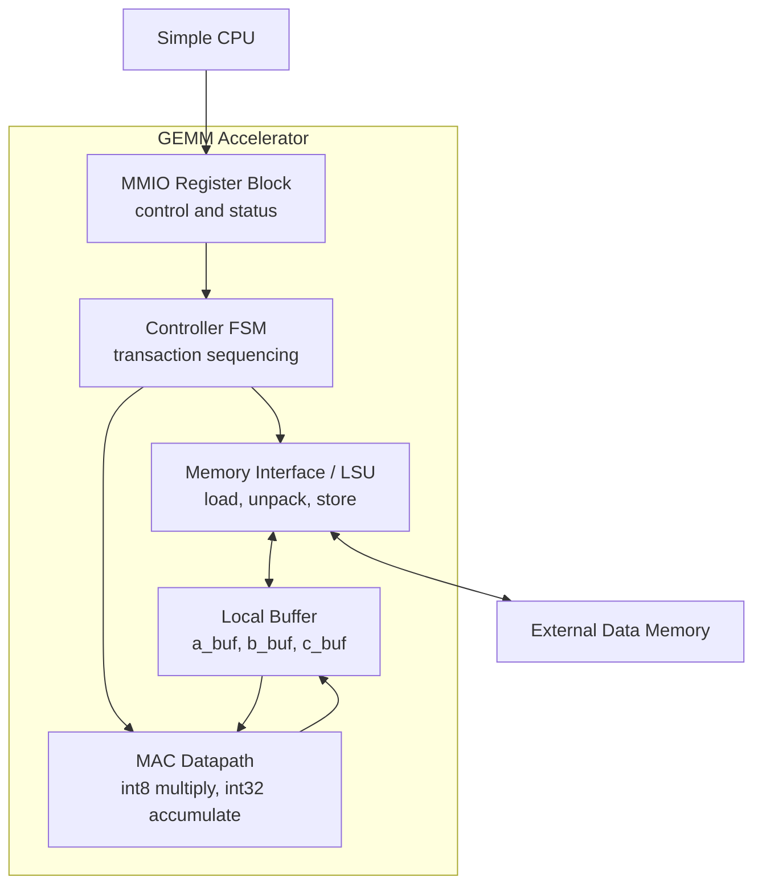

# GEMM Accelerator Spec

GEMM accelerator는 Simple CPU가 넘긴 matrix 위치와 크기를 받아 `C = A x B`를 계산하는 coprocessor이다. CPU는 작업을 시작하고 상태를 확인하는 역할만 맡고, accelerator가 A/B load, MAC accumulation, C writeback을 수행한다.

## Design Snapshot

| 항목 | Baseline 결정 |
| --- | --- |
| Operation | `C = A x B` |
| Matrix size | `1 <= M,N,K <= 4` |
| Input type | signed int8 |
| Product type | signed int16 |
| Accumulator / output type | signed int32 |
| Input layout | A/B packed, 4 int8 per 32-bit word |
| Output layout | C unpacked, 1 int32 per 32-bit word |
| Compute datapath | 1-MAC serial |

## Dataflow

```text
CPU register writes
        |
        v
MMIO Register Block
        |
        v
Controller FSM
        |
        v
Load A/B from external memory
        |
        v
Local Buffer
        |
        v
MAC Datapath
        |
        v
Store C to external memory
```

이 흐름에서 CPU와 직접 만나는 블록은 MMIO Register Block뿐이다. Memory Interface는 external memory만 상대하고, MAC Datapath는 local buffer만 상대한다.

## Block Responsibilities

| Block | 이 블록이 끝까지 책임지는 일 |
| --- | --- |
| MMIO Register Block | CPU가 쓴 base address, dimension, control bit를 보관하고 status bit를 CPU에게 보여준다. |
| Controller FSM | IDLE, LOAD, COMPUTE, STORE, DONE 순서를 결정하고 각 블록의 enable 조건을 만든다. |
| Memory Interface / LSU | A/B packed word read, int8 lane unpack, C int32 writeback을 처리한다. |
| Local Buffer | 최대 4x4 A/B/C tile을 accelerator 내부에 잡아두어 compute와 memory access를 분리한다. |
| MAC Datapath | signed int8 곱셈과 signed int32 누산으로 C element를 만든다. |

## Architecture



## Transaction Narrative

1. CPU가 `A_BASE`, `B_BASE`, `C_BASE`, `M`, `N`, `K`를 MMIO register에 쓴다.
2. CPU가 `CTRL.start`를 write한다.
3. FSM이 dimension을 검사한다.
4. 유효한 transaction이면 LSU가 A/B를 external memory에서 읽어 local buffer에 적재한다.
5. MAC datapath가 `C = A x B`를 계산하고 결과를 `c_buf`에 저장한다.
6. LSU가 `c_buf`의 C 결과를 external memory에 writeback한다.
7. FSM이 `done=1`을 set하고 CPU가 읽을 status를 유지한다.

Invalid dimension이면 memory access를 시작하지 않는다. 이 경우 `done=1`, `error=1`, `invalid_size=1`을 보고하고 CPU의 `clear_done`을 기다린다.

## GEMM Operation

Matrix shape은 아래와 같다.

```text
A: M x K
B: K x N
C: M x N
```

지원 범위는 baseline에서 작게 고정한다.

```text
1 <= M <= 4
1 <= N <= 4
1 <= K <= 4
```

각 output element는 아래 식으로 계산한다.

```text
C[i][j] = sum(A[i][k] * B[k][j]), k = 0..K-1
```

1-MAC serial baseline에서는 한 cycle에 product 하나를 누산하는 구조를 기준으로 한다.

```text
compute_cycles = M * N * K
```

## Local Buffers

| Buffer | Element type | 최대 element 수 | 용도 |
| --- | --- | --- | --- |
| `a_buf` | signed int8 | 16 | A tile 저장 |
| `b_buf` | signed int8 | 16 | B tile 저장 |
| `c_buf` | signed int32 | 16 | C tile 누산 결과 저장 |

4x4까지 지원하므로 각 buffer는 최대 16개 element를 담으면 충분하다.

## FSM States

```text
IDLE -> LOAD -> COMPUTE -> STORE -> DONE
```

### IDLE

CPU의 설정을 기다리는 상태이다. CPU가 `CTRL.start`를 write하면 FSM은 `M`, `N`, `K`가 지원 범위 안에 있는지 먼저 검사한다.

Valid transaction이면 `LOAD`로 이동한다. Invalid transaction이면 실제 연산은 시작하지 않고 `done=1`, `error=1`, `invalid_size=1`을 set한 뒤 `DONE` 의미의 종료 상태를 유지한다.

### LOAD

External memory에 packed format으로 저장된 A/B matrix를 읽어 내부 buffer에 적재한다.

```text
packed A/B word read
        |
        v
int8 lane unpack
        |
        v
a_buf / b_buf write
```

A/B는 32-bit word 하나에 signed int8 4개가 들어간다. LSU는 필요한 word를 읽고 lane을 골라 signed int8 element로 해석한다. LOAD가 끝나면 `COMPUTE`로 이동한다.

### COMPUTE

`a_buf`와 `b_buf`를 읽어 MAC datapath에서 C element를 만든다.

```text
a_buf / b_buf -> MAC datapath -> c_buf
```

Input은 signed int8이고 product는 signed int16이다. C는 product들의 합이므로 signed int32 accumulator에 누산한다. COMPUTE 결과는 external memory에 바로 쓰지 않고 먼저 `c_buf`에 저장한다.

### STORE

`c_buf`에 저장된 signed int32 결과를 external memory에 writeback한다. C는 packing하지 않으므로 C element 하나가 32-bit word 하나를 차지한다.

```text
C_index     = i * N + j
C_word_addr = C_BASE + C_index
```

모든 C element writeback이 끝나면 `DONE`으로 이동한다.

### DONE

Transaction 종료를 CPU에게 보고하는 상태이다.

```text
busy = 0
done = 1
```

정상 완료이면 `error=0`이고, dimension 오류 같은 문제가 있으면 `error=1`이다. `done`은 성공 신호가 아니라 종료 신호이므로 CPU는 반드시 `error`를 함께 확인한다.

`done`과 error-related flag는 CPU가 `CTRL.clear_done`을 write할 때까지 유지된다. `clear_done`이 들어오면 sticky flag를 clear하고 IDLE로 복귀한다.

## Extension Roadmap

| 단계 | Compute 구조 | 기대 효과 |
| --- | --- | --- |
| Baseline | 1-MAC serial | 구현과 검증이 단순하다. |
| Extension | 4-MAC row-parallel | 한 row의 여러 column을 병렬로 계산할 수 있다. |
| Stretch | 8-MAC 또는 systolic array | 더 큰 병렬성을 실험할 수 있다. |
